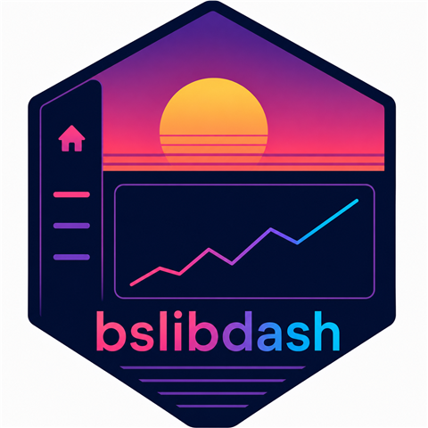

# bslibdash 

<!-- badges: start -->
[](https://lifecycle.r-lib.org/articles/stages.html#maturing)
[](https://github.com/Novartis/bslibdash/actions/workflows/R-CMD-check.yaml)
[](https://opensource.org/licenses/MIT)
<!-- badges: end -->

bslibdash gives you the vocabulary of a dashboard — a page shell, a
sidebar menu, cards, KPI tiles, header widgets — built on top of
[bslib](https://rstudio.github.io/bslib/) and Bootstrap 5. Because it's
a thin layer over bslib, dashboards built with bslibdash inherit your
theme, dark mode and `bslib::bs_themer()` for free, and play nicely
with other bslib-based Shiny packages like
[teal](https://insightsengineering.github.io/teal/).

If you know [shinydashboard](https://rstudio.github.io/shinydashboard/),
you already know most of the bslibdash API: function names and
arguments mirror it wherever the underlying concept is the same, so
porting an existing app is mostly search-and-replace.

## Features

* A responsive **page shell**: header, collapsible/overlay sidebar,
  body and footer.
* **Sidebar navigation** with menus, sub-items, badges and a user
  panel.
* **Cards** that collapse, close and go full-screen, plus tabbed
  cards.
* **KPI tiles** — value boxes and info boxes on the Bootstrap status
  palette.
* **Header widgets** for messages, notifications and tasks.
* Full **theming** through `bslib::bs_theme()`: components recompile
  their CSS automatically, so custom themes never lose bslibdash
  styles.

## Installation

bslibdash isn't on CRAN yet. Install the development version from
GitHub:

``` r
# install.packages("pak")
pak::pak("Novartis/bslibdash")
```

## Usage

```r
library(shiny)
library(bslibdash)

ui <- dashboardPage(
  header = dashboardHeader(title = "bslibdash demo"),
  sidebar = dashboardSidebar(
    sidebarUserPanel("Jane Doe", subtitle = "Administrator"),
    sidebarMenu(
      id = "sidebarMenu",
      menuItem("Overview", tabName = "overview", icon = icon("house")),
      menuItem("Reports",  tabName = "reports",  icon = icon("bar-chart"))
    )
  ),
  body = dashboardBody(
    tabItems(
      tabItem(
        "overview",
        boxLayout(
          valueBox("128", "Open tickets", icon = icon("inbox"),
                   color = "primary"),
          valueBox("42%", "CPU load",     icon = icon("cpu"),
                   color = "warning"),
          infoBox("Status", "Healthy",    icon = icon("heart-pulse"),
                  color = "success")
        ),
        box("Hello, world!", title = "Welcome",
            status = "primary", collapsible = TRUE)
      ),
      tabItem("reports", box("Report body", title = "Quarterly"))
    )
  )
)

shinyApp(ui, server = function(input, output, session) {})
```

For a full walk-through of every component, run the kitchen-sink demo:

``` r
shiny::runApp(
  system.file("shiny/examples/14_kitchen_sink", package = "bslibdash")
)
```

## Why bslibdash?

* **vs raw [bslib](https://rstudio.github.io/bslib/)** — bslib gives
  you the building blocks (themes, cards, sidebars). bslibdash
  assembles them into a dashboard: a page shell, a sidebar menu with
  sub-items and badges, header dropdowns, KPI tiles — so you don't
  rebuild them in every app.
* **vs [shinydashboard](https://rstudio.github.io/shinydashboard/)** —
  same names, same mental model, but rendered with Bootstrap 5 and
  themed through bslib. Dynamic theming, dark mode and `bs_themer()`
  work out of the box.
* **vs [bs4Dash](https://bs4dash.rinterface.com/)** — bslibdash
  stays close to vanilla bslib, so dashboards inherit your bslib theme
  rather than carrying a bespoke AdminLTE one.

Because bslibdash is just bslib underneath, it also slots into apps
built with [teal](https://insightsengineering.github.io/teal/), raw
`bslib::page_*()` layouts,
[shinyuieditor](https://rstudio.github.io/shinyuieditor/) and
[bsicons](https://github.com/rstudio/bsicons) — all sharing the same
theme, dark mode and `bs_themer()` machinery as your dashboard shell.

## Learn more

* [Get started](https://opensource.nibr.com/bslibdash/articles/getting-started.html) —
  a minimal skeleton and a migration guide from shinydashboard.
* [Components](https://opensource.nibr.com/bslibdash/articles/components.html) —
  a copy-pasteable tour of every component.
* [Theming](https://opensource.nibr.com/bslibdash/articles/theming.html) —
  customise `brand_bs_theme()`, swap Bootswatch presets, add your own
  SCSS, and use `bslib::bs_themer()`.
* [Function reference](https://opensource.nibr.com/bslibdash/reference/index.html) —
  every exported function, organised by topic.
* More example apps live in [`inst/shiny/examples/`](inst/shiny/examples).

## Getting help

If you find a bug, please open an
[issue](https://github.com/Novartis/bslibdash/issues) with a minimal
reproducible example. To propose a change, see
[CONTRIBUTING.md](CONTRIBUTING.md).

## Code of Conduct

Please note that this project is released with a
[Contributor Code of Conduct](https://www.contributor-covenant.org/version/2/1/code_of_conduct/).
By contributing to this project, you agree to abide by its terms.
